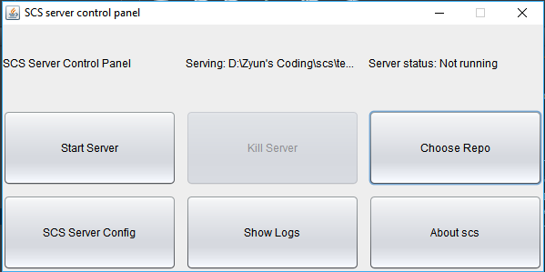
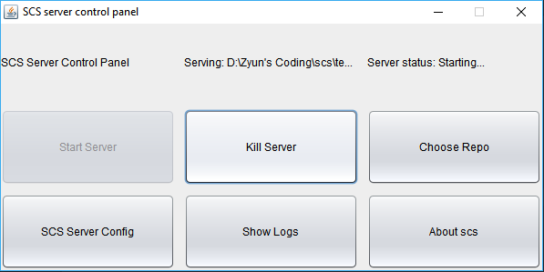

How the server works
====================

SCS server is started by running the server.

A screen should come up, it should look something like this:

The `Serving` part does not need to be full.

Choose a server, in `Choose Repo`, and press start server. The server should start, and look something like this:

Currently, there is no way to kill the server, so just kill the server by going to task manager, and killing the app, or killing the app by the ide, if you used one.

### How the server works

This server isn't too complex, but it does need some understanding. The basics are here.

The server starts by the client sending the verification code, a long string of hexadecimal letters. If it is correct, it passes. If it is wrong, it closes the connection. Then, it receives the command.

#### Checking out repos
To check out the repo, the client sends a `get` command, then, the server sends the commit number, UUID, and the repo name. If it can find a zip file, if it exists.

#### Pushing
First, the client sends the repo uuid, to verify the repo. Then, it sends the number of files to push, and the size of the files. Then, the server creates a temp file, to compare all the files, for the diff.

#### Problems with the server:
 1. The server cannot be killed by it self.
 2. The server cannot work with large zip files.
